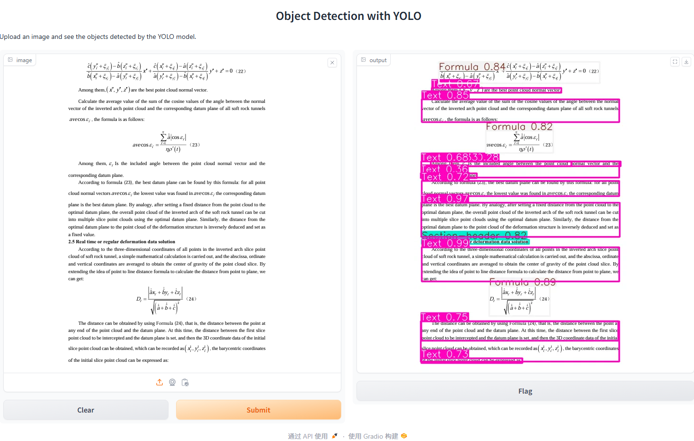

# DocumentLayout

DocumentLayout is an object detection model used to analyze document layout. A total of 11 types were detected in the layout of the document.

* Caption
* Footnote
* Formula
* List-item
* Page-footer
* Page-header
* Picture
* Section-header
* Table
* Text
* Title

## Model Training

### Data

DocLayNet: [DS4SD/DocLayNet: DocLayNet: A Large Human-Annotated Dataset for Document-Layout Analysis (github.com)](https://github.com/DS4SD/DocLayNet)

### Data Preprocessing

coco format data needs to be converted to Yolov8 input format in advance.

Please refer to dataset.py

## Model Predicting

Please refer to [test.py](./test.py)

## Gradio UI

