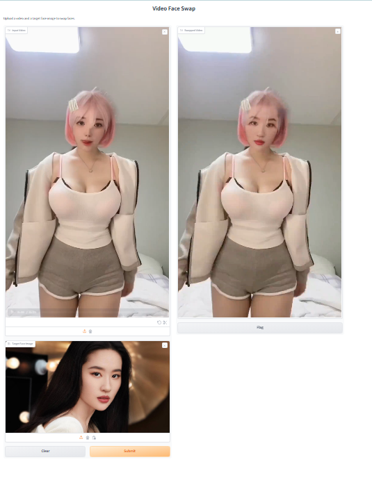

# Video Face Swap

## Start Application

### Conda Env

[environment.yaml](./config/environment.yaml)

### Gradio WebUI

Enter the directory "FaceSwap",then start the Gradio

`python gradio_video_faceswap.py`

Input your video that needs swap face and target face image,then submit.
